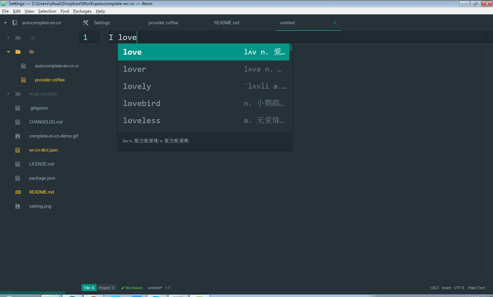

# autocomplete-en-cn package

# Introduction
An autocomplete-plus provider completing English words with Chinese explanation.

This package requires autocomplete-plus.

# Usage

For the defined file type, it will complete automatically. Like the figure shows.

 The default setting includes text file, latex file, markdown file, null grammar file. If you need to add your file type, add the type string in the setting panel.

To enable completion for your current file type: put your cursor in the file, open the Command Palette (cmd+shift+p), and run the Editor: Log Cursor Scope command. This will trigger a notification which will contain a list of scopes. The first scope that's listed is the one you should add to the list of scopes in the settings for the Spell Check package. Here are some examples: .source.gfm (markdown file), .text.plain (text file), .text.tex.latex (latex file).

# Acknowledgement

Inspired by autocomplete-APPLEASMx64.
"# autocomplete-en-cn" 
